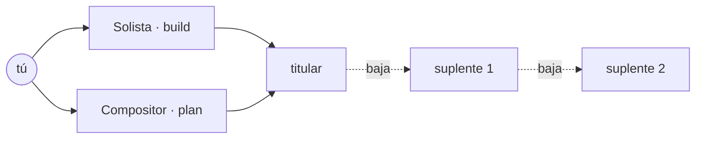

# 🎭 reparto

A cada agente lo interpreta un titular y, si está de baja, entra su suplente.

reparto es un plugin nativo de OpenCode V2 que reemplaza a oh-my-opencode (OMO) en mi setup. Lo hice para mí: los agentes, los modelos y las reglas son los que yo uso a diario, y el repo es público por si a alguien más le sirve. No está en npm y no busco que lo esté.

## Cómo funciona

Cada agente de V2 con entrada en `reparto.jsonc` tiene un actor titular (un modelo con su variant) y suplentes en orden. reparto impone el titular en el primer turno de cada sesión y en cada hija nativa, en lugar del modelo que la hija heredaría de su padre. Si el titular se da de baja por cuota agotada, 5xx repetidos o auth, el siguiente pedido ya sale con el primer suplente disponible, sin cortar la sesión.



Las bajas viven en SQLite y las comparten todos los procesos de OpenCode: una cuota agotada en OpenAI da de baja a todos los modelos de ese proveedor, en todas las sesiones, hasta el reset que informe el proveedor o hasta que venza `plazoBaja`.

## Los agentes

El vocabulario canónico está en [`CONTEXT.md`](./CONTEXT.md). El plugin no inyecta agentes: son de V2, nativos o de la config (`agents/*.md`). Los que usa el ensayo están en [`agentes/`](./agentes/) y se copian (o se enlazan) a la config:

| Agente       | Qué es                                                                   | Dónde vive                 | Antes en OMO      |
| ------------ | ------------------------------------------------------------------------ | -------------------------- | ----------------- |
| `build`      | Solista: trabajo directo y ejecución de planes aprobados.                | nativo                     | `sisyphus`        |
| `plan`       | Compositor: entrevista, escribe el plan, lo ensaya y lo manda a revisar. | nativo + `agentes/plan.md` | `prometheus`      |
| `explore`    | Explora el código del repo. Solo lectura.                                | nativo + `opencode.json`   | `explore`         |
| `general`    | Lo que Solista delegue para implementar.                                 | nativo                     | `sisyphus-junior` |
| `archivista` | Busca documentación y código fuera del repo.                             | `agentes/archivista.md`    | `librarian`       |
| `tiresias`   | Consulta de solo lectura para decisiones difíciles; revisa planes.       | `agentes/tiresias.md`      | `oracle`          |
| `critico`    | Revisa planes en el ensayo general.                                      | `agentes/critico.md`       | `momus`           |

`build` y `plan` se muestran como Solista y Compositor: el config de V2 no tiene `name`, así que ese renombre lo hace el plugin.

## Planes

El Compositor entrevista, escribe el plan y lo pasa por el ensayo general con `ensayar`: el crítico y tiresias lo revisan en paralelo, cada uno en un proveedor distinto, en rondas hasta que ambos aprueban la misma versión. Las objeciones aceptadas en la primera ronda se congelan en el acta; las siguientes solo verifican que se cierren. Recién con el ensayo cerrado (o en la ronda 5, cuando decido yo) reparto deja pasar `submit_plan`, que abre la revisión de [plannotator](https://github.com/backnotprop/plannotator). Lo que apruebo ahí lo ejecuta Solista.

## Opiniones

- **Solo lo que funciona sin que el modelo coopere.** El director, los papeles y el regidor dependían de que el modelo siguiera un protocolo, y peleaba contra los permisos; las suplencias corren en hooks. [ADR 0014](./docs/adr/0014-suplencias-y-agentes-reales.md)
- **El ensayo es obligatorio.** Una guía en el prompt no alcanza: un hook rechaza `submit_plan` sin ensayo cerrado. [ADR 0014](./docs/adr/0014-suplencias-y-agentes-reales.md), [ADR 0006](./docs/adr/0006-director-sin-edicion.md)
- **Ensayo general con revisores en proveedores distintos.** Un modelo que revisa a su propia familia comparte sus puntos ciegos. [ADR 0011](./docs/adr/0011-ensayo-general.md)
- **El tipo de error decide a quién da de baja.** Cuota agotada da de baja al proveedor entero; un 5xx reintenta el mismo actor. [ADR 0004](./docs/adr/0004-suplentes-por-tipo-de-error.md)
- **Variant crudo, sin traducción ni herencia.** Todos los bugs de razonamiento de OMO vinieron de su capa heurística. [ADR 0002](./docs/adr/0002-variant-crudo-sin-herencia.md)
- **Estado en SQLite.** Varios procesos de OpenCode a la vez; con JSON se pisan. [ADR 0010](./docs/adr/0010-estado-en-sqlite.md)
- **Guiones en inglés, identificadores en español.** El resto del contexto del modelo está en inglés; el dominio en español resalta y no choca con el stack. [ADR 0008](./docs/adr/0008-guiones-propios-en-ingles.md), [ADR 0003](./docs/adr/0003-identificadores-en-espanol.md)
- **Fuera de alcance.** Hashline edit, grep y glob propios, team mode, keyword modes: vuelven solo si se extrañan en uso real. [ADR 0005](./docs/adr/0005-fuera-de-alcance.md)

## Instalación

OpenCode 2.0.18 o posterior, git y curl. En cualquier PC:

```sh
curl -fsSL https://raw.githubusercontent.com/JosueGalRe/reparto/estable/scripts/instalar.sh | sh
```

[`scripts/instalar.sh`](./scripts/instalar.sh) agrega `github:JosueGalRe/reparto#estable` y plannotator a `plugins` en `~/.config/opencode/opencode.json` (con respaldo; los comentarios del JSONC se pierden), copia los agentes de [`agentes/`](./agentes/) a `~/.config/opencode/agents/` y, si no hay `reparto.jsonc`, deja [`reparto.ejemplo.jsonc`](./reparto.ejemplo.jsonc), repartido para GitHub Copilot y Kiro. Volver a correrlo actualiza el plugin (V2 fija el commit instalado y lo trae con `plugin.update`) y los agentes, sin tocar tu `reparto.jsonc`. V2 instala el plugin desde git y Bun lo carga sin compilar. El plugin lee `~/.config/opencode/reparto.jsonc`, o la ruta de `options.config`. Un `reparto.jsonc` mínimo:

```jsonc
{
  "$schema": "https://raw.githubusercontent.com/JosueGalRe/reparto/estable/schema/reparto.schema.json",
  "fallosInternos": 3,
  "agentes": {
    "build": {
      "titular": { "model": "claude-code/claude-opus-5-5", "variant": "xhigh" },
      "suplentes": [{ "model": "openai/gpt-5.5", "variant": "high" }],
    },
    "explore": {
      "titular": { "model": "opencode-go/kimi-k3" },
    },
  },
  "proveedores": {
    "openai": { "plazoBaja": "7d" },
  },
}
```

Cada reparto es `{ titular, suplentes? }` y cada actor es `{ model: "<providerID>/<modelID>", variant? }`. El variant es el id exacto del catálogo de V2; si lo omites, corre el default del proveedor. `fallosInternos` es cuántos 5xx o timeouts seguidos aguanta un actor antes de que entre su suplente (default 3). `plazoBaja` (`"30m"`, `"5h"`, `"7d"`) es cuánto dura una baja por cuota si el proveedor no informa el reset. Un agente sin entrada queda en manos de V2: sus hijas heredan el modelo del padre. Si la config no cumple el schema, el plugin queda inactivo y lo dice en el log.

Para el ensayo hacen falta los agentes `critico` y `tiresias` en la config de V2, con entrada en `reparto.jsonc`, y el Compositor tiene que saber usar `ensayar`: son los de [`agentes/`](./agentes/). Los agentes de solo lectura repiten al final las restricciones de la base, porque gana la última regla que coincide.

## Tools

| Tool         | Qué hace                                                                                                                |
| ------------ | ----------------------------------------------------------------------------------------------------------------------- |
| `ensayar`    | Solo para el Compositor. Corre una ronda del ensayo general sobre el texto del plan; devuelve los veredictos y el acta. |
| `pendientes` | Lee o reescribe la lista de trabajo de la sesión. Sobrevive a la compactación.                                          |

## Desarrollo

```sh
bun run check                        # tipos, lint, formato y tests
scripts/run.sh serve --port 4297     # servidor aislado, con su propio REPARTO_DATA_DIR en /tmp
bun run bundle                       # dist/server.js autocontenido
scripts/publicar.sh [destino-ssh]    # empuja estable e instala el bundle local (y por ssh)
```

`scripts/run.sh` usa `scripts/config` como config global y nunca toca el servidor diario; `scripts/config/agents` apunta a [`agentes/`](./agentes/), y el `reparto.jsonc` de desarrollo va en `/tmp/reparto-dev/reparto.jsonc`. El estado de reparto (SQLite y log) vive en `REPARTO_DATA_DIR`, por defecto `$XDG_DATA_HOME/reparto`. `scripts/publicar.sh` actualiza el worktree estable desde `main`, empuja la rama `estable` a GitHub (la que instala `instalar.sh`), construye el bundle e instala `server.js` y el schema en `~/.local/share/reparto/plugin/`; con un destino como `ssh://usuario@host:puerto`, también los instala en esa ruta del remoto. El remoto solo necesita Bun y OpenCode, no el repo ni `node_modules`.

## Documentación

- [`CONTEXT.md`](./CONTEXT.md): el vocabulario.
- [`docs/adr/`](./docs/adr/): las decisiones.
- [`docs/plan.md`](./docs/plan.md): el plan de construcción original, por fases (histórico).
- [`docs/sondas.md`](./docs/sondas.md): lo que se probó contra V2 antes de decidir.

## Licencia

Uso personal.
