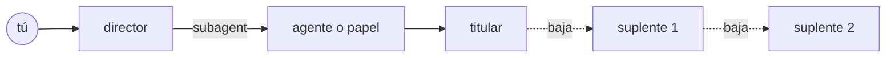

# 🎭 reparto

El director reparte el trabajo. Cada papel lo interpreta un titular y, si está de baja, entra su suplente.

reparto es un plugin nativo de OpenCode V2 que reemplaza a oh-my-opencode (OMO) en mi setup. Lo hice para mí: los agentes, los papeles y las reglas son las que yo uso a diario, y el repo es público por si a alguien más le sirve. No está en npm y no busco que lo esté.

## Cómo funciona

Le pides algo al director. El director no edita: reparte el trabajo con el `subagent` nativo de V2 entre agentes (por nombre) y papeles (por tipo de trabajo). A cada agente o papel lo interpreta un actor titular (un modelo con su variant). Si el titular está de baja, por cuota agotada, 5xx repetidos o auth, entra el primer suplente disponible, en orden.



Las bajas viven en SQLite y las comparten todos los procesos de OpenCode: una cuota agotada en OpenAI da de baja a todos los modelos de ese proveedor, en todas las sesiones, hasta el reset que informe el proveedor o hasta que venza `plazoBaja`.

## El elenco

El vocabulario canónico está en [`CONTEXT.md`](./CONTEXT.md); esto es solo el reparto.

| Agente       | Qué hace                                              | Antes en OMO |
| ------------ | ----------------------------------------------------- | ------------ |
| `director`   | Recibe tus pedidos, los reparte y verifica. No edita. | `sisyphus`   |
| `dramaturgo` | Escribe planes.                                       | `prometheus` |
| `critico`    | Revisa planes.                                        | `momus`      |
| `regidor`    | Ejecuta un plan estrenado, al pie de la letra.        | `atlas`      |
| `utilero`    | Explora el código del repo. Solo lectura.             | `explore`    |
| `archivista` | Busca documentación y código fuera del repo.          | `librarian`  |
| `tiresias`   | Consulta de solo lectura para decisiones difíciles.   | `oracle`     |

| Papel          | Cuándo se usa                                                  | Antes en OMO         |
| -------------- | -------------------------------------------------------------- | -------------------- |
| `rapido`       | Cambios mecánicos y acotados, sin decisiones de diseño.        | `quick`              |
| `visual`       | Todo cambio cuyo resultado se ve.                              | `visual-engineering` |
| `protagonista` | Default para implementar: hay que entender el código antes.    | `deep-low`           |
| `estelar`      | Solo por escalamiento: protagonista falló o tiresias lo marcó. | `ultrabrain`         |
| `prosa`        | Entregables que son texto para personas.                       | `writing`            |

## Planes

El dramaturgo escribe el plan en `.reparto/planes/<slug>.md`. Después viene el ensayo general: el crítico y Tiresias lo revisan en paralelo, cada uno en un proveedor distinto, en rondas hasta que ambos aprueban la misma versión. Las objeciones aceptadas en la primera ronda se congelan en el acta; las siguientes solo verifican que se cierren. Un plan cerrado se estrena solo con mi visto bueno (`/estreno`), y desde ahí el archivo no cambia. El regidor lo ejecuta y el avance queda en SQLite, así que una sesión nueva retoma donde quedó la anterior.

## Opiniones

- **Desde cero, sin fork de OMO.** OMO es un plugin V1 sobre un shim; un fork habría sido plomería V1 para reescribir hook por hook. [ADR 0001](./docs/adr/0001-desde-cero-nativo-v2.md)
- **El director no edita.** Con la guía solo en el prompt, Opus delegaba 0.1 tareas por sesión; los permisos lo obligan. [ADR 0006](./docs/adr/0006-director-sin-edicion.md)
- **Cinco papeles, sin comodín.** El `unspecified-*` de OMO absorbió 224 tareas por definirse por exclusión. [ADR 0007](./docs/adr/0007-cinco-papeles-sin-comodin.md)
- **El tipo de error decide a quién da de baja.** Cuota agotada da de baja al proveedor entero; un 5xx reintenta el mismo actor. [ADR 0004](./docs/adr/0004-suplentes-por-tipo-de-error.md)
- **Variant crudo, sin traducción ni herencia.** Todos los bugs de razonamiento de OMO vinieron de su capa heurística. [ADR 0002](./docs/adr/0002-variant-crudo-sin-herencia.md)
- **Estado en SQLite.** Varios procesos de OpenCode a la vez; con JSON se pisan. [ADR 0010](./docs/adr/0010-estado-en-sqlite.md)
- **Ensayo general con revisores en proveedores distintos.** Un modelo que revisa a su propia familia comparte sus puntos ciegos. [ADR 0011](./docs/adr/0011-ensayo-general.md)
- **Delegación con el `subagent` nativo.** El ADR anterior descartó el nativo por un motivo falso. [ADR 0013](./docs/adr/0013-delegacion-con-subagent-nativo.md)
- **Guiones en inglés, identificadores en español.** El resto del contexto del modelo está en inglés; el dominio en español resalta y no choca con el stack. [ADR 0008](./docs/adr/0008-guiones-propios-en-ingles.md), [ADR 0003](./docs/adr/0003-identificadores-en-espanol.md)
- **Fuera de alcance.** Hashline edit, grep y glob propios, team mode, keyword modes: vuelven solo si se extrañan en uso real. [ADR 0005](./docs/adr/0005-fuera-de-alcance.md)

## Requisitos e instalación

OpenCode 2.0.18 (`@opencode/plugin` 2.0.18) y Bun.

```sh
git clone <este repo> ~/proyectos/reparto
cd ~/proyectos/reparto
bun install
```

Registra el plugin en tu `opencode.json`:

```json
{
  "plugins": [
    {
      "package": "file:///ruta/a/reparto",
      "options": { "config": "~/.config/opencode/reparto.jsonc" }
    }
  ]
}
```

`options.config` es opcional; por defecto lee `~/.config/opencode/reparto.jsonc`. Un `reparto.jsonc` mínimo:

```jsonc
{
  "$schema": "/ruta/a/reparto/schema/reparto.schema.json",
  "fallosInternos": 3,
  "agentes": {
    "director": {
      "titular": { "model": "claude-code/claude-opus-5-5", "variant": "xhigh" },
      "suplentes": [{ "model": "openai/gpt-5.5", "variant": "high" }],
    },
  },
  "papeles": {
    "protagonista": {
      "titular": { "model": "openai/gpt-5.5", "variant": "high" },
      "suplentes": [{ "model": "opencode-go/kimi-k3" }],
    },
  },
  "proveedores": {
    "openai": { "plazoBaja": "7d" },
  },
}
```

Cada reparto es `{ titular, suplentes? }` y cada actor es `{ model: "<providerID>/<modelID>", variant? }`. El variant es el id exacto del catálogo de V2; si lo omites, corre el default del proveedor. `fallosInternos` es cuántos 5xx o timeouts seguidos aguanta un actor antes de que entre su suplente (default 3). `plazoBaja` (`"30m"`, `"5h"`, `"7d"`) es cuánto dura una baja por cuota si el proveedor no informa el reset. Si la config no cumple el schema, el plugin queda inactivo y lo dice en el log.

### Vengo de OMO

`scripts/migrate-omo.ts` convierte tu `omo.jsonc` a `reparto.jsonc`: mapea los agentes y las categorías a la tabla de arriba y corrige cada `reasoning` contra el catálogo real de V2, dejando un comentario donde tuvo que decidir.

El catálogo sale de `scripts/api.sh model.list`, que habla con el servidor de desarrollo del puerto 4297 (ver Desarrollo).

```sh
scripts/api.sh model.list > model.list.json
bun scripts/migrate-omo.ts ~/.config/opencode/omo.jsonc model.list.json > ~/.config/opencode/reparto.jsonc
```

Lo que no tiene equivalente no se migra: `hephaestus`, `metis`, `sisyphus-junior`, `multimodal-looker`, `deep-high`, `unspecified-*`, `artistry`, `modelConcurrency` y `runtime_fallback`.

## Tools

| Tool          | Qué hace                                                                                                            |
| ------------- | ------------------------------------------------------------------------------------------------------------------- |
| `bitacora`    | Muestra lo que hizo un encargo: sus tool calls y su mensaje final. Con `detalle: "completo"` agrega los resultados. |
| `ensayar`     | Corre una ronda del ensayo general sobre un plan de `.reparto/planes/`; devuelve los veredictos y el acta.          |
| `interrumpir` | Interrumpe un encargo abierto de la propia sesión, por ejemplo uno estancado.                                       |
| `pendientes`  | Lee o reescribe la lista de trabajo de la sesión. Sobrevive a la compactación.                                      |

Y un comando: `/estreno .reparto/planes/<plan>.md [con-objeciones]` estrena un plan que pasó el ensayo general y abre la sesión del regidor.

## Desarrollo

```sh
bun run check                        # tipos, lint, formato y tests
scripts/run.sh serve --port 4297     # servidor aislado, con su propio REPARTO_DATA_DIR en /tmp
scripts/publicar.sh                  # fast-forward de main al worktree estable
```

`scripts/run.sh` usa `scripts/config` como config global y nunca toca el servidor diario. El estado de reparto (SQLite y log) vive en `REPARTO_DATA_DIR`, por defecto `$XDG_DATA_HOME/reparto`. Lo que corre a diario es el worktree en `~/.local/share/reparto/estable`, que `scripts/publicar.sh` actualiza desde `main`.

## Documentación

- [`CONTEXT.md`](./CONTEXT.md): el vocabulario.
- [`docs/adr/`](./docs/adr/): las decisiones.
- [`docs/plan.md`](./docs/plan.md): el plan de construcción, por fases.
- [`docs/sondas.md`](./docs/sondas.md): lo que se probó contra V2 antes de decidir.
- [`guiones/`](./guiones/): las instrucciones de cada agente y papel.

## Licencia

Uso personal. Los archivos que traen código o texto de OMO conservan su aviso SUL-1.0 ([ADR 0001](./docs/adr/0001-desde-cero-nativo-v2.md)).
